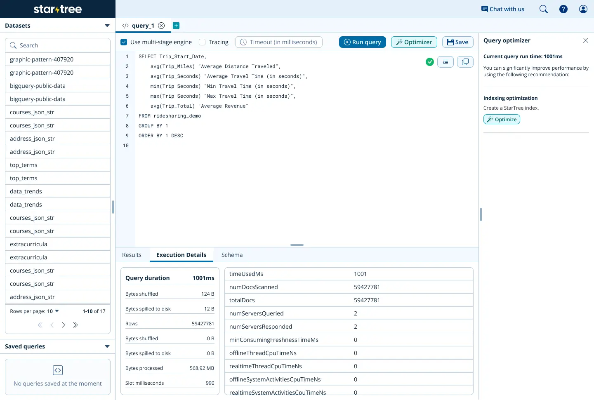
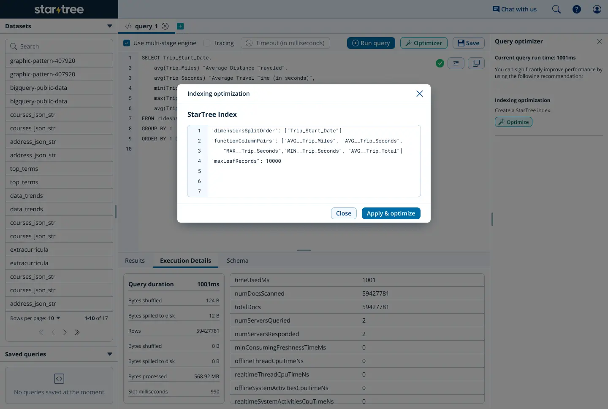
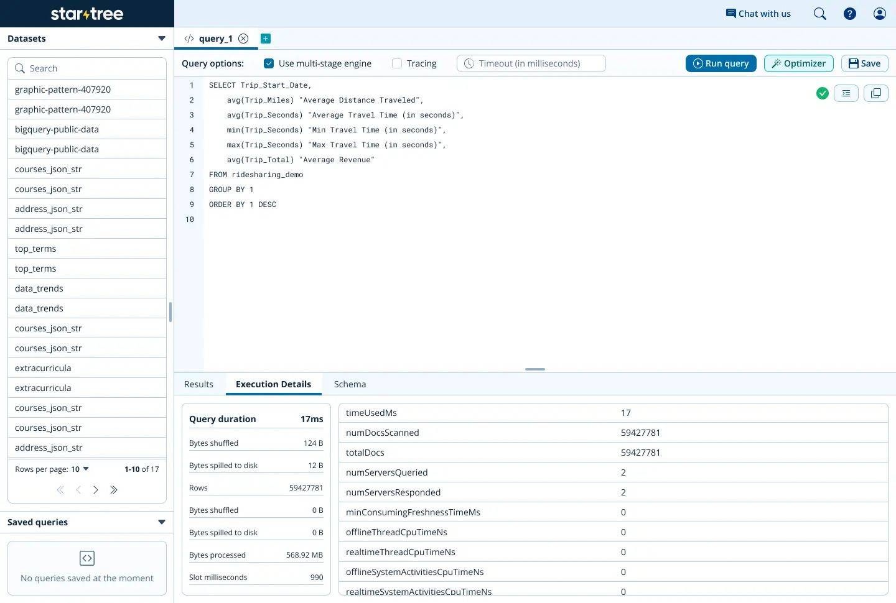

# systems optimizations

### introduction
over the past year, i've been working on optimizers and autotuners for systems. specifically, i created the new [performance manager](https://startree.ai/resources/automate-real-time-operations) at startree and, more recently, worked on a [query optimizer for pinot](https://github.com/apache/pinot/pull/14385) that i find pretty exciting.

### performance manager
let’s start with startree’s performance manager - a tool allowing users to discover possible optimizations for their pinot clusters given a query. prior to the performance manager, users had to either have a large amount of expertise about pinot hyperparameter tuning or the money to hire someone who did. performance manager was meant to bridge this gap and allow every customer to discover the power of pinot - even organizations that are just getting started. the manager also made it onto [a press release](https://www.globenewswire.com/news-release/2024/11/20/2984361/0/en/StarTree-Unveils-New-Features-to-Tackle-Data-Management-and-Security-Challenges-for-Scaling-Real-Time-Analytics.html), which i think is pretty fun.

performance manager is quite easy to use. you just begin with running your query. let’s try a simple query like this:
```
select Trip_Start_Date,
	avg(Trip_Miles) "Average Distance Traveled",
	avg(Trip_Seconds) "Average Travel Time (in seconds)",
	min(Trip_Seconds) "Min Travel Time (in seconds)",
	max(Trip_Seconds) "Max Travel Time (in seconds)",
	avg(Trip_Total) "Average Revenue"
from ridesharing_demo
group by 1
order by 1 desc
```
we can run this query in our query console as such:



see that “optimize” button on the side? that’ll trigger performance manager to run on the query you just ran. it looks like that query has some aggregations and the total number of documents scanned is pretty high. seems like a star-tree index would fit right in here! performance manager suggests just that, and even advises on the max leaf records and dimension split order.



let’s try running that same query again to see how our optimization fared:



looks like we brought our total query runtime down from 1001 milliseconds to 17 milliseconds. that’s pretty good! by iteratively running the manager and analyzing the key metrics (runtime, number of documents scanned, etc.), users can easily maximize the functionality and utility from their startree pinot clusters.

**let's talk about how it works though.**

the performance manager began with gathering a load of “features” from the system. these numerical features allowed the manager to capture the state of the database, within the context of the given query. these features captured things like the estimated cardinalities of referenced columns and the relative selectivity of different predicates within the query filter.

using these features,performance manager then had a list of heuristics - essentially classification functions that ran with collections of features as parameters. by this, we could build a more complete and holistic understanding of each column’s significance within the query while also understanding what possible optimizations could be applicable to a given column.

after all this processing, performance manager then returned its suggestions on a bunch of indexes - sorted, inverted, star-tree, json, bloom filter. it could even distinguish between the unique use cases for finite state transducer (fst) and lucene text indexes. importantly, performance manager also advised on dictionary/no-dict/var-length-dict indexing, weighing whether the space tradeoff for each indexing type was worth it.

there are a couple of things i think would be natural and useful extensions of this tool. perhaps most obviously, the manager would benefit from a machine learning model that could more easily and accurately suggest optimizations from a series of captured features over time. such a model would be able to learn from past suggestions and continuously improve. additionally, the performance manager could benefit from analyzing sets of queries, rather than single, isolated queries. through this, the performance manager would have a better understanding of how columns are being used over time, rather than in a specific (and possibly anomalous) context.

### pinot query optimizers
i also recently worked on a [query optimizer for apache pinot](https://github.com/apache/pinot/pull/14385) that i'm pretty proud of. the optimizer sounds pretty simple - take queries that use the `datetrunc`function on a column in the query filter and rewrite them as a simple range filter on the column.

the `datetrunc` function basically truncates a timestamp at a given granularity. it also has some other parameters that can specify input and output time units and timezones. it also has a doc page you can read [here](https://docs.pinot.apache.org/configuration-reference/functions/datetrunc) (time functions are very hard to write documentation for).

without an optimizer, the database has no way to “invert” the `datetrunc` function. thus, to retrieve the results of the query, the database has to apply the function to every value in the column and then check that output value against the literal in the query. let’s look at an example query:
```
select * from mytable where datetrunc('DAY', col) < 1620777600010
```
without the optimizer, the database has to iterate through every value in `col`, apply `datetrunc('DAY', value)` and then compare it against 1620777600010. the optimizer would simply convert the above query into the following:
```
select * from mytable where col <= 1620863999999
```
the reasoning for this conversion is fairly straightforward. since 1620777600010 isn’t aligned directly with the `DAY` granularity (1620777600000 is the closest value), we know that every value up until the the next granularity step (non-inclusive) will truncate to 1620777600000, which is less than 1620777600010, which leads us to the above query rewrite.

the process to complete this rewrite is also pretty straightforward:
1. convert all the time values into milliseconds (trust me, it makes things *much* easier)
2. set a `lowerMillis` and `upperMillis` to be the lower and upper bounds of the range filter
3. convert `lowerMillis` and `upperMillis` to the column's time unit
4. return the final range query

to complete step 2 of the above process, i implemented two functions - `dateTruncFloor` and `dateTruncCeil`. these functions take in an output value and compute the ceiling or floor, respectively, of the inverse of the `datetrunc` function (think solving for `x`, given a set `y` value for `f(x) = y`). using these functions, we can determine the upper and lower bounds of the range pretty easily.

it turns out that dealing with timezones is pretty hard. hard enough that it took me 3 months (and a lot of help from johan adami) to determine that the best course of action was to skip over this functionality right now. i'm still experimenting on how to make timezones work for this `datetrunc` optimizer. i'll get it one day, but for now it's amazing for 98% of use cases.

### conclusion
i know i'm pretty young, but i know one thing for certain - i’ve fallen in love with systems optimization. there’s something profoundly captivating about the idea that performance isn’t just about raw power — it’s about precision, adaptability, and balance. autotuning is more than just an engineering challenge, it’s a way to unlock the full potential of technology without forcing users to become experts themselves.

for too long, peak performance has been locked behind expertise, reserved for those who can navigate the labyrinth of configurations or afford to outsource it. but why's that the case? the power of well-tuned systems shouldn’t be a privilege. it should be accessible and intuitively available to everyone.

that’s the future I want to build. a future where systems don’t just work—they optimize themselves, adapting in real time to deliver the best possible experience without human intervention. a future where technology serves people, not the other way around.

we’re on the cusp of something incredible, and i’m honestly excited to be a part of it.
