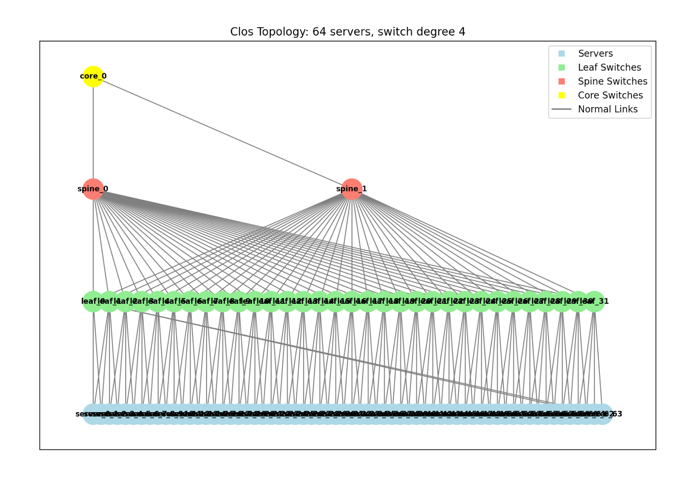
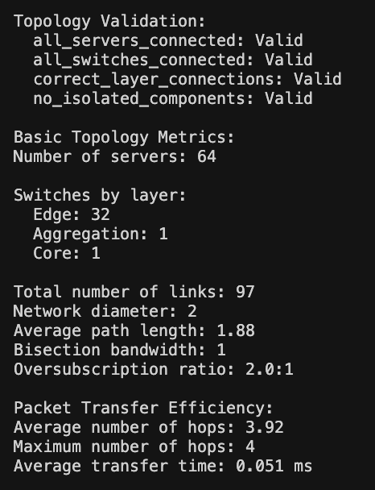
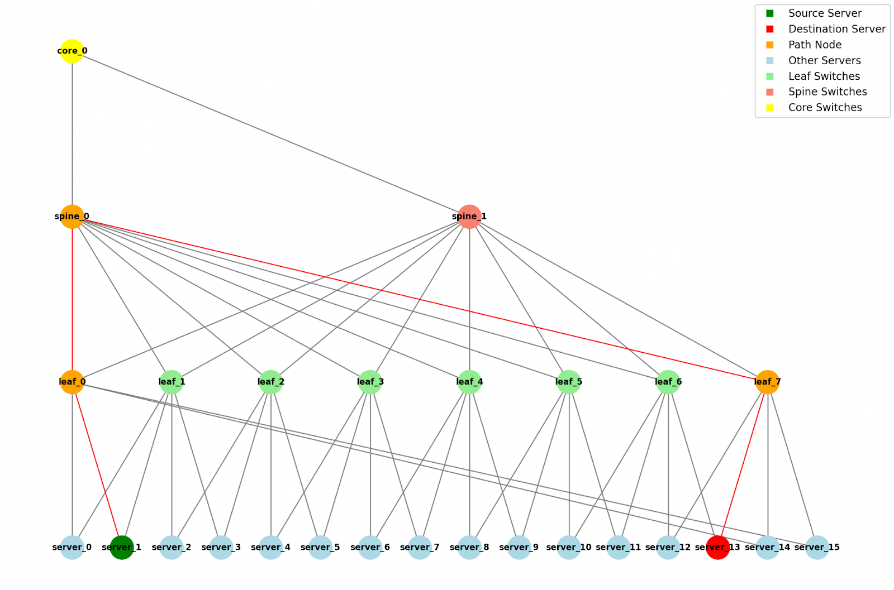

# clos topologies and ecmp

i recently finished a class on data center systems, and i got pretty excited about clos topologies and equal-cost multi-path (ecmp) routing. for my final project, i made a program to generate these topologies, validate them, and simulate them to see how they perform in terms of latency and throughput. i also implemented oversubscription, which was a cool way to balance cost and performance. let’s dive into what i discovered.

### what are clos topologies
clos topologies are a network design named after charles clos from the 1950s. in data centers, they’re often set up as leaf-spine architectures. imagine leaf switches connected to servers, and spine switches linking all the leaves together, like a web. every leaf connects to every spine, creating multiple paths for data to travel. this setup is great because it scales well - you can add more leaves for more servers or more spines for more bandwidth - and keeps latency low, which is key for fast communication. former traditional hierarchical network designs struggled with the increasing east-west traffic (traffic between servers within the data center), which led to the adoption of leaf-spine architectures, a common implementation of clos topologies.

### structure & design of clos topologies
in the leaf-spine architecture, leaf switches connect directly to servers, while spine switches form a full mesh with the leaves, ensuring every leaf is connected to every spine. this design allows for communication between any two servers in just two hops, which is pretty key for maintaining low latency. the parameters defining a clos network include:  
- `n`: number of ports per leaf switch connected to servers.
- `m`: number of spine switches.
- `r`: number of leaf switches.
for a strict-sense non-blocking network, the condition is `m ≥ 2n−1`, meaning there are enough spine switches to handle all possible connections without blocking. however, in practice, data centers often use rearrangeably non-blocking configurations where `m ≥ n`, which is sufficient for most traffic patterns and reduces costs. this was a key takeaway from our lectures, highlighting the balance between performance and economics.

| parameter   | description                                                                                                                                                                                                                                                                                                                                   |
| ----------- | --------------------------------------------------------------------------------------------------------------------------------------------------------------------------------------------------------------------------------------------------------------------------------------------------------------------------------------------- |
| stages      | ingress, middle, egress, each made up of crossbar switches.                                                                                                                                                                                                                                                                                   |
| parameters  | defined by integers `n`, `m`, `r`:   - `n`: number of sources feeding each of `r` ingress stage crossbar switches.   - `m`: number of outlets per ingress switch and number of middle stage crossbar switches.   - `r`: number of ingress and egress stage switches.                                                                 |
| connections | - each ingress switch (`r` total) has `n` inputs, and `m` outputs.   - middle stage has `m` switches, each with `r` inputs, `r` outputs.   - each egress switch (`r` total) has `m` inputs, `n` outputs.   - exactly one connection between each ingress and each middle stage switch, and each middle and each egress stage switch. |
scalability is a huge strength of clos networks - the ability of add more leaves or spines horizontally makes it ideal for large-scale data centers.

### ecmp-enhanced performance
ecmp, or equal-cost multi-path routing, was another concept we explored deeply. it distributes traffic across multiple paths of equal cost, which in clos topologies means using different spine switches to forward packets between leaves. we learned that ecmp uses a hash of the packet’s five-tuple—source ip, destination ip, source port, destination port, and protocol—to select a path, ensuring packets from the same flow take the same route to maintain order, while different flows are load-balanced across paths.
this improves throughput by utilizing all available links and enhances resilience against link failures. i found it interesting that modern switches often implement ecmp in hardware for high performance, which was a detail that surprised me given the complexity involved. this load balancing is crucial for handling the high volumes of east-west traffic in data centers.

### implementing clos topologies
for my final project, i worked on a program to generate clos topologies, validate them, and simulate their performance. validation involved ensuring no loops, checking connectivity, and confirming multiple paths existed, which was facilitated by modeling the network in networkx, which allows you to create virtual networks.
here's an example of one of our generated clos topologies:

simulation was key to estimating latency and throughput and was surprisingly pretty straightforward. i generated traffic patterns like all-to-all communication, where every server sends to every other, and random permutation traffic, where each server sends to one other randomly. these simulations helped us measure how the network performs under different loads. you then could get a small report about the validation and simulation metrics as seen below:

we also added the ability to see all possible routes between two given servers as such:

### oversubscription
oversubscription was a concept we covered extensively, defined as the ratio of total server bandwidth to uplink bandwidth at the leaf level. in my project, i implemented it by setting up a topology with `n` leaf switches, each with `x` server ports at `y` gbps (`x * y` gbps total) and `n` spine switches with `a` ports at `b` gbps each (`a * b` gbps uplink), resulting in a 2:1 oversubscription ratio. this meant that if all servers tried to send at full rate, the uplinks would be congested, potentially increasing latency and packet loss.
oversubscription is primarily a cost-saving measure, as provisioning full bandwidth for all servers would be expensive. however, it comes with trade-offs, especially under heavy loads. through simulations, i experimented with different ratios, like increasing spine bandwidth to reduce oversubscription, and observed improvements in performance. we ultimately decided on our fixed 2:1 oversubscription ratio as that seemed to be the easiest to visualize.

### applications & insights
through this project, i gained hands-on experience with how clos topologies, ecmp, and oversubscription work together. major tech companies like google and meta use clos-based designs in their data centers, due to clos topologies' ability to handle massive traffic efficiently. the regularity of the design also simplifies automation, which is definitely an interesting idea i want to explore in the future.
one thing that surprised me was how simulations revealed the impact of traffic patterns on performance. for example, with a 3:1 oversubscription ratio in another scenario (48 server ports at 10 gbps and 4 spine ports at 40 gbps), the network handled light loads well but degraded quickly under all-to-all traffic, highlighting the importance of traffic engineering.

### conclusion
clos topologies and ecmp are foundational for building scalable, high-performance data center networks. simulations, especially with tools like networkx, provided me with insights into latency, throughput, and the effects of oversubscription, bridging theory and practice. this class has sparked a newfound interest in networking. whilst i probably won't be working directly at the data center networking level, i've definitely found a new fascination with what i previously thought was pretty boring.
